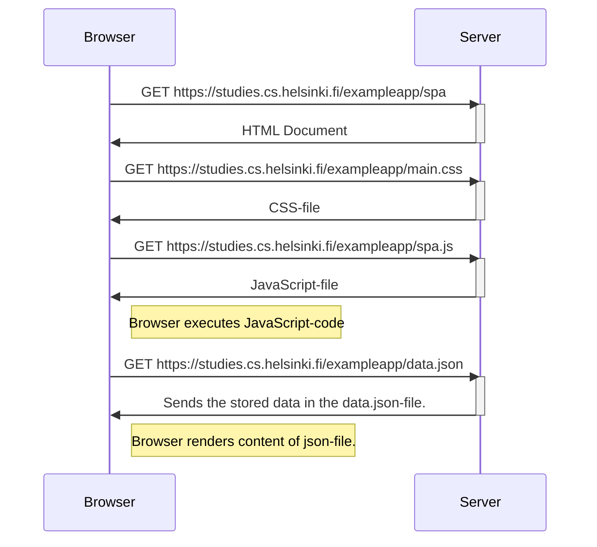

```mermaid
sequenceDiagram
    participant Browser
    participant Server
    Browser->>Server: GET https://studies.cs.helsinki.fi/exampleapp/spa
    activate Server
    Server->>Browser: HTML Document
    deactivate Server
    Browser->>Server: GET https://studies.cs.helsinki.fi/exampleapp/main.css
    activate Server
    Server->>Browser: CSS-file
    deactivate Server
    Browser->>Server: GET https://studies.cs.helsinki.fi/exampleapp/spa.js
    activate Server
    Server->>Browser: JavaScript-file
    deactivate Server
    Note right of Browser: Browser executes JavaScript-code
    Browser->>Server: GET https://studies.cs.helsinki.fi/exampleapp/data.json
    activate Server
    Server->>Browser: Sends the stored data in the data.json-file.
    deactivate Server
    Note right of Browser: Browser renders content of json-file.
```
